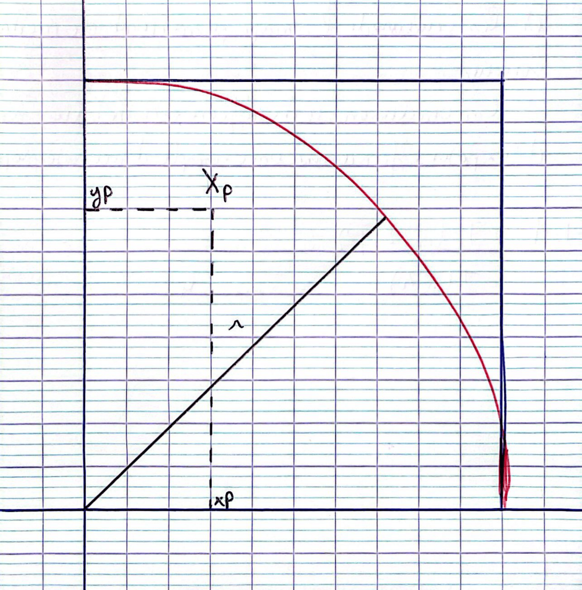
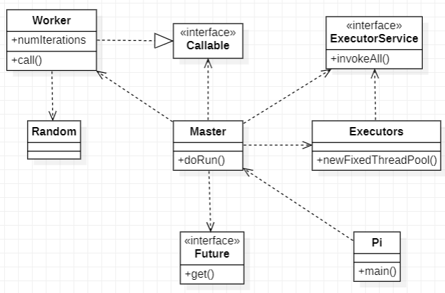
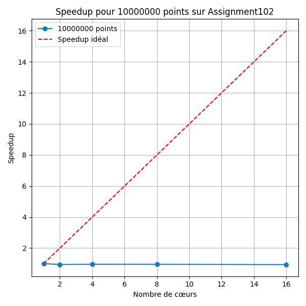
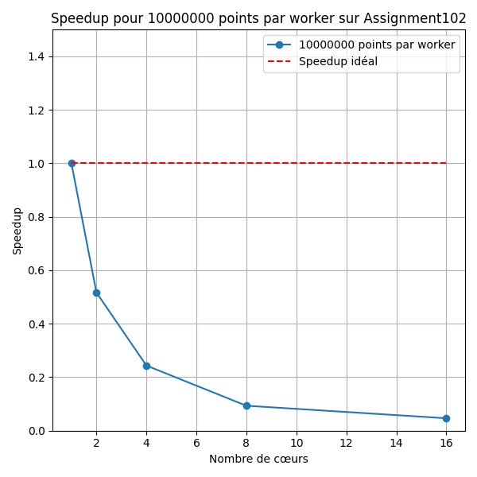
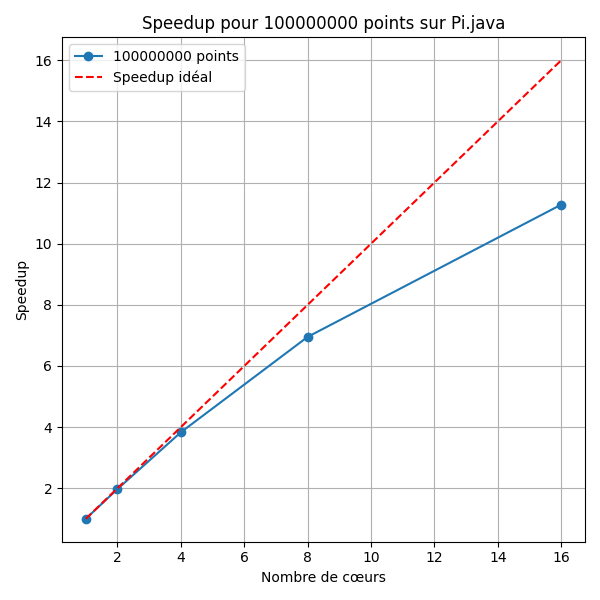
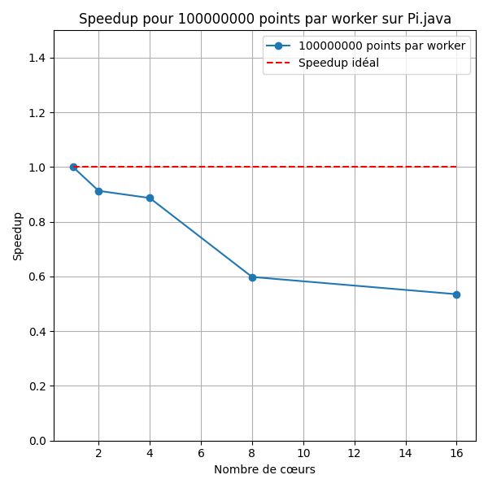

# Introduction

Ce rapport explore l'utilisation de la méthode de Monte Carlo (MC) pour calculer π en exploitant le parallélisme sur des architectures à mémoire partagée et distribuée. Après une présentation de l’algorithme séquentiel, nous étudions des variantes parallèles (itération parallèle, maître-esclave) et analysons deux implémentations Java.

Enfin, nous étendons l’étude aux environnements à mémoire distribuée et au parallélisme sur plusieurs machines, en évaluant les performances des différentes approches. Ce travail vise à fournir une vue synthétique et claire des stratégies et résultats obtenus.

Ce rapport a été en partie rédigé par ChatGPT, dans le but de le simplifier et de le rendre le plus clair et concis possible.

# I. Monte Carlo pour calculer π

La méthode de Monte Carlo repose sur une estimation probabiliste pour approximer π à partir de tirages aléatoires.

Soit AD l’aire d’un  de disque de rayon ( r = 1 ) :
$$
A_{\text{D}} = \frac{\pi r^2}{4} = \frac{\pi}{4}
$$

Le disque est inscrit dans un carré de côté ( r = 1 ), dont l’aire est :
$$
A_c = r^2 = 1
$$

On considère un point ( X_p (x_p, y_p) ) généré aléatoirement dans ce carré, où ( x_p ) et ( y_p ) suivent la loi uniforme ( U(0, 1) ).

La probabilité que ( X_p ) appartienne au  de disque est donnée par :
$$
P = \frac{A_{\text{D}}}{A_c} = \frac{\pi}{4}
$$

-------------------- 



--------------------

Pour estimer cette probabilité, on effectue n tot tirages aléatoires. Soit n cible le nombre de points qui satisfont la condition x p 2 + y p 2 ≤ 1 , c’est-à-dire les points situés dans le quart de disque.

Si n tot est suffisamment grand, par la loi des grands nombres, la fréquence observée n cible / n tot converge vers la probabilité P , soit :
P = n cible n tot ≈ π 4

On peut ainsi en déduire une approximation de π :
π ≈ 4 ⋅ n cible n tot

Ainsi, plus n tot augmente, plus l'estimation de π se précise.

## II. Algorithme et parallélisation

### A. Itération parallèle

L’algorithme de Monte Carlo peut être parallélisé en distribuant les tirages sur plusieurs tâches indépendantes. Voici l'algorithme séquentiel de base :

#### Algorithme de base

```c
n_cible = 0;
for (p = 0; n_tot > 0; n_tot--) {
    x_p = rand();  // Générer un nombre aléatoire entre ]0,1[
    y_p = rand();
    if ((x_p * x_p + y_p * y_p) < 1) {
        n_cible++;
    }
}
pi = 4 * n_cible / n_tot;
```

Dans cette version, tout est exécuté séquentiellement. Pour paralléliser ce code, il faut identifier les tâches et leurs dépendances.
Identification des tâches

    Tâche principale (T0) : Tirer et compter les n_tot points.

    Tâche secondaire (T1) : Calculer ππ après la collecte de n_cible :

Dépendances et parallélisme

    Dépendances :
        T1 dépend de T0 : ππ ne peut être calculé qu’après avoir obtenu n_cible.
        T0p2 dépend de T0p1 : Un point doit être généré avant sa vérification.

    Indépendances parallèles :
        Les générations de points (T0p1) peuvent être effectuées simultanément, chaque tirage étant indépendant.
        Les vérifications (T0p2) peuvent aussi être parallélisées, mais nécessitent une gestion sécurisée de n_cible pour éviter des conflits d’accès.

Algorithme parallèle

L’algorithme parallèle repose sur une fonction dédiée TirerPoint() pour générer et évaluer les points.

TirerPoint() est indépendante et permet donc d'éxecuter chaque tirage sur plusieurs threads sans dépendance entre eux.

# B. Paradigme Master/Worker

Le modèle **Master/Worker** repose sur une division du travail en unités indépendantes, chacune traitée par un **Worker** (processus ou thread). Chaque Worker effectue un certain nombre de tirages aléatoires, et un processus principal, appelé **Master**, agrège les résultats pour calculer π.

## 1. Principe du modèle

- Le travail total (`n_tot` tirages) est réparti équitablement entre `n_workers`.
- Chaque Worker exécute une fonction indépendante pour traiter sa part des tirages.
- Le Master collecte les résultats des Workers et calcule l'estimation finale de π.

Ce modèle permet d'optimiser l'utilisation des ressources tout en minimisant les conflits d'accès mémoire.

---

## 2. Algorithme Master/Worker

### **Fonctions principales**

```cpp
function TirerPoint() {
    x_p = rand();  // Générer un nombre aléatoire dans ]0,1[
    y_p = rand();
    return ((x_p * x_p + y_p * y_p) < 1);
}

function MCWorker(n_charge) {
    n_cible_partiel = 0;
    for (p = 0; n_charge > 0; n_charge--) {
        if (TirerPoint()) {
            n_cible_partiel += 1;
        }
    }
    return n_cible_partiel;
}
```
- TirerPoint() : génère un point aléatoire et vérifie s'il appartient au quart de disque.
- MCWorker(n_charge) : effectue n_charge tirages et compte ceux appartenant au quart de disque.

```cpp
n_charge = n_tot / n_workers;
ncibles = [NULL * n_workers];

parallel for (worker = 0; worker < n_workers; worker++) {
    ncibles[worker] = MCWorker(n_charge);
}

n_cible = sum(ncibles);
pi = 4 * n_cible / n_tot;
```

- Chaque Worker traite n_charge = n_tot / n_workers points.
- Le tableau ncibles stocke les résultats de chaque Worker.
- Une fois le calcul terminé, le Master additionne les valeurs et estime π.

## 3. Gestion des ressources et parallélisation
Élimination des conflits d'accès

Contrairement à l’itération parallèle, où plusieurs threads modifiaient une variable partagée (n_cible), ici :

    Chaque Worker possède son propre compteur local (n_cible_partiel), évitant ainsi les conflits.
    Le seul élément partagé est le tableau ncibles, mais chaque Worker écrit dans une case distincte.

Optimisation et scalabilité

    Réduction des conflits : aucun verrouillage nécessaire, améliorant l’efficacité.
    Répartition équilibrée : chaque Worker traite une charge équivalente, ce qui optimise l'utilisation des ressources.
    Adaptabilité aux architectures distribuées : le modèle fonctionne aussi bien sur des architectures multi-cœurs que sur des systèmes distribués.


# 4. Avantages du modèle Master/Worker

| **Critère**         | **Avantage** |
|---------------------|-------------|
| **Synchronisation** | Réduction des conflits grâce à des compteurs locaux |
| **Efficacité**      | Exécution parallèle optimisée sans accès concurrent à une variable critique |
| **Scalabilité**     | Supporte un grand nombre de Workers sans perte de performance |
| **Modularité**      | Adaptable aux architectures distribuées, avec des Workers sur différentes machines |

# III. Mise en œuvre sur Machine

Nous allons maintenant examiner deux implémentations pratiques de la méthode de Monte Carlo pour le calcul de π. L’objectif est d’analyser leur structure et leur approche de parallélisation :

- Identifier le modèle de programmation parallèle utilisé dans chaque code ainsi que le paradigme suivi (itération parallèle ou Master/Worker).
- Vérifier si ces implémentations correspondent aux algorithmes proposés en **partie II**.

Dans la **partie IV**, nous effectuerons une analyse détaillée de chaque code en évaluant leur **scalabilité forte et faible**.

---

## A. Analyse de *Assignment102*

L’implémentation *Assignment102* utilise l’API **Concurrent** pour paralléliser les calculs nécessaires à l’estimation de π avec la méthode de Monte Carlo. Voici les principaux éléments analysés :

### 1. Structure et API utilisée

#### Gestion des threads :
- Le code utilise `ExecutorService` avec un **pool de threads adaptatif** (`newWorkStealingPool`), exploitant efficacement les cœurs disponibles sur la machine.
- Chaque tirage (génération d’un point aléatoire) est exécuté dans une tâche indépendante via `Runnable`.

#### Synchronisation avec AtomicInteger :
- La variable partagée `nAtomSuccess`, qui compte le nombre de points dans le quart de disque, est protégée par un compteur atomique (`AtomicInteger`) pour éviter les **conflits d’accès** entre threads.

---

### 2. Modèle de programmation parallèle et paradigme

| **Aspect**        | **Détails** |
|------------------|------------|
| **Modèle utilisé** | **Itération parallèle** : chaque tirage correspond à une tâche indépendante soumise au pool de threads. |
| **Paradigme**     | Suit le modèle d’itération parallèle défini en **partie II.A**. Chaque tâche effectue un tirage de manière indépendante, sans dépendances entre elles. |

---

### 3. Lien avec notre pseudo-code

L’implémentation correspond globalement au pseudo-code d’**itération parallèle**, avec les adaptations suivantes :

- Le compteur `n_cible` est remplacé par un **AtomicInteger** pour gérer les **sections critiques**.
- Le découplage des threads est **géré par l’API `ExecutorService`**.

---


## B. Analyse de *Pi.java*

L’implémentation *Pi.java* repose sur l’utilisation des **Futures et Callables** pour paralléliser le calcul de π à l’aide de la méthode de Monte Carlo.

### 1. Qu’est-ce qu’un Future ?  
Un **Future** est un conteneur pour un résultat **calculé de manière asynchrone**. Il permet de :

- **Soumettre une tâche** : lorsqu’un thread exécute une tâche, son résultat est **stocké** dans un Future.
- **Récupérer le résultat** : l’appel à `.get()` récupère la valeur, mais **bloque** tant que le calcul n’est pas terminé.  
  → Cela introduit une **barrière implicite** qui synchronise les résultats des différents threads.
- **Vérifier l’état d’exécution** : un `Future` peut indiquer si une tâche est **terminée ou a échoué**.

**Pourquoi l’utiliser ici ?**  
Les **Futures** garantissent que chaque résultat partiel est **prêt avant l’agrégation**, permettant une synchronisation **optimale** entre les threads.

---



---

### 2. Modèle de programmation parallèle et paradigme

| **Aspect**        | **Détails** |
|------------------|------------|
| **Modèle utilisé** | **Master/Worker** : le Master crée des Workers pour effectuer les calculs et regroupe leurs résultats à l’aide des **Futures**. |
| **Paradigme**     | Basé sur des **tâches**, avec une gestion explicite via **Callables**. |

---

### 3. Structure et API utilisée

#### 🔹 Parallélisation avec des Callables :
- Chaque **Worker** est un `Callable<Long>` qui exécute un sous-ensemble du calcul total.
- Il **compte les points dans le quart de disque** pour un certain nombre d’itérations.
- Ces Callables sont exécutés par un **pool de threads fixe** (`FixedThreadPool`).

#### 🔹 Gestion des résultats avec des Futures :
- Lorsqu’un `Callable` est soumis au pool de threads, il retourne un **Future<Long>**.
- L’appel à `.get()` bloque le thread principal jusqu’à ce que **tous les résultats** soient prêts.
- Une fois collectés, ces résultats sont **agrégés** pour calculer π.

---

### 4. Lien avec notre pseudo-code

L'algorithme suit fidèlement le modèle **Master/Worker** décrit en **partie II.B** :

| **Élément**       | **Correspondance dans le code** |
|------------------|--------------------------------|
| **Master**       | Gère la répartition des tâches et l’agrégation des résultats. |
| **Workers**      | Exécutés via des `Callables`, chaque Worker applique la méthode `MCWorker()`. |
| **Division**     | Le Master répartit **équitablement** les tirages (`n_charge`) entre les Workers. |

---

### 5. Comparaison avec *Assignment102*

| **Critère**           | **Pi.java (Master/Worker)** | **Assignment102 (Itération parallèle)** |
|----------------------|---------------------------|----------------------------------|
| **Isolation des calculs** | Chaque Worker gère ses propres données. | Accès concurrent à une variable atomique. |
| **Synchronisation** | Réduite à l’agrégation finale (moins coûteux). | Synchronisation fréquente via `AtomicInteger`. |
| **Gestion des threads** | Callables et `FixedThreadPool`. | `ExecutorService` avec `Runnable`. |
| **Performance attendue** | Plus efficace pour un grand nombre de threads. | Risque de **goulots d’étranglement** dû aux accès atomiques. |

---

🔎 **Conclusion générale**  
L’implémentation *Pi.java* est **plus efficace** qu’*Assignment102* car elle :
1. **Réduit la synchronisation coûteuse** (seule l’agrégation des résultats est bloquante).
2. **Minimise les accès concurrents** grâce à l’**isolation des Workers**.
3. **Optimise la gestion des threads** via les **Futures**, permettant une meilleure scalabilité.

On peut donc **s’attendre à de meilleures performances**, **surtout sur des machines multicœurs** et avec **un grand nombre de points et de threads**. 

# IV. Évaluations et tests de performances

La partie suivante contient des éléments d'un autre rapport que j'écris en parallèle de celui-ci, qui concerne le module de Qualité de Développement en troisième année de BUT informatique.

L'ordinateur qui a réalisé ces calculs possède les spécifications suivantes :

- **Processeur** : 11th Gen Intel(R) Core(TM) i7-11800H @ 2.30GHz
- **8 cœurs physiques**
- **16 cœurs logiques**

Notez que les résultats des tests qui suivent ne seront pas les mêmes selon l'architecture matérielle sur lesquels ils ont été effectués.

### A. Programme de calcul de performance

Le script **PerformanceTester.java** teste différentes implémentations de Monte Carlo pour calculer π en s'appuyant sur une interface standardisée **MonteCarloImplementation**. Chaque implémentation doit fournir deux méthodes : `execute(int totalPoints, int numCores)` et `getName()`.

Le programme récupère les données de tests (nombre de cœurs, de points, et répétitions) depuis un fichier CSV. Il exécute ensuite les tests sur chaque implémentation puis enregistre les résultats (temps d'exécution, approximation de π, erreur relative) dans un fichier `resultats.csv`.

L'outil est modulaire, ce qui permet d'ajouter facilement de nouvelles versions de Monte Carlo à tester. Il automatise également l'évaluation des performances pour différents scénarios et configurations.

---

### B. Tests de Scalabilité

Les tests de scalabilité servent à évaluer la performance des différentes implémentations en fonction du nombre de cœurs utilisés, selon deux approches : **scalabilité forte** et **scalabilité faible**.

##### 1. **Scalabilité Forte**

La **scalabilité forte** mesure la capacité d'un programme à réduire son temps d'exécution lorsque le nombre de cœurs augmente, tout en maintenant la charge de travail totale constante. Elle évalue comment le programme exploite efficacement les ressources supplémentaires.

On la mesure à l’aide du **speedup**, défini comme :

\[
\text{Speedup} = \frac{\text{Temps\_1\_cœur}}{\text{Temps\_N\_cœurs}}
\]

Un **speedup idéal** serait linéaire, c'est-à-dire un gain proportionnel au nombre de cœurs.

##### **Scénarios de test pour la scalabilité forte :**

| Nombre de processeurs | Nombre total de points | Points par processeur |
|-----------------------|------------------------|-----------------------|
| 1                     | 1,000,000              | 1,000,000             |
| 2                     | 1,000,000              | 500,000               |
| 4                     | 1,000,000              | 250,000               |
| 8                     | 1,000,000              | 125,000               |
| 16                    | 1,000,000              | 62,500                |
| 1                     | 10,000,000             | 10,000,000            |
| 2                     | 10,000,000             | 5,000,000             |
| 4                     | 10,000,000             | 2,500,000             |
| 8                     | 10,000,000             | 1,250,000             |
| 16                    | 10,000,000             | 625,000               |
| 1                     | 100,000,000            | 100,000,000           |
| 2                     | 100,000,000            | 50,000,000            |
| 4                     | 100,000,000            | 25,000,000            |
| 8                     | 100,000,000            | 12,500,000            |
| 16                    | 100,000,000            | 6,250,000             |

Dans ce cas, on garde le nombre total de points constant et on varie le nombre de processeurs pour observer la réduction du temps d'exécution. Le **speedup** est mesuré pour chaque configuration.

##### 2. **Scalabilité Faible**

La **scalabilité faible** évalue la capacité d'un programme à maintenir un temps d'exécution constant lorsque le nombre de cœurs et la charge de travail totale augmentent proportionnellement. Cela simule un scénario où chaque cœur traite une part fixe de travail supplémentaire.

Elle est également mesurée à l’aide du **speedup**, calculé de la même manière que pour la scalabilité forte, mais ici avec une charge croissante. Un **speedup idéal** serait constant, ce qui se traduirait par une droite horizontale.

##### **Scénarios de test pour la scalabilité faible :**

| Nombre de processeurs | Nombre total de points | Points par processeur |
|-----------------------|------------------------|-----------------------|
| 1                     | 1,000,000              | 1,000,000             |
| 2                     | 2,000,000              | 1,000,000             |
| 4                     | 4,000,000              | 1,000,000             |
| 8                     | 8,000,000              | 1,000,000             |
| 16                    | 16,000,000             | 1,000,000             |
| 1                     | 10,000,000             | 10,000,000            |
| 2                     | 20,000,000             | 10,000,000            |
| 4                     | 40,000,000             | 10,000,000            |
| 8                     | 80,000,000             | 10,000,000            |
| 16                    | 160,000,000            | 10,000,000            |
| 1                     | 100,000,000            | 100,000,000           |
| 2                     | 200,000,000            | 100,000,000           |
| 4                     | 400,000,000            | 100,000,000           |
| 8                     | 800,000,000            | 100,000,000           |
| 16                    | 1,600,000,000          | 100,000,000           |

Dans ce cas, on augmente proportionnellement la charge de travail avec le nombre de cœurs pour tester la capacité du programme à maintenir un temps d'exécution constant.

---
### C. Résultats de l'implémentation Assignment102

Pour évaluer la scalabilité de l'implémentation **Assignment102**, le code a été modifié afin de permettre un contrôle précis du nombre de processeurs utilisés. Cela remplace l'utilisation dynamique de `Runtime.getRuntime().availableProcessors()` et nous permet de fixer le nombre de cœurs pour chaque test via l'initialisation de la classe `PiMonteCarlo`.

#### 1. Résultats de la Scalabilité Forte

Les tests de **scalabilité forte** ont été effectués en lançant plusieurs simulations avec des configurations variées de nombre de cœurs et de points. Chaque test a été répété cinq fois pour calculer la moyenne des résultats.

| Nombre de cœurs | Points lancés | Points par cœur | Temps d'exécution (ms) | Approximation de π | Erreur              |
|-----------------|---------------|-----------------|------------------------|-------------------|---------------------|
| 1               | 1,000,000     | 1,000,000       | 91.5                   | 3.1415024         | 3.02 × 10⁻⁵        |
| 2               | 1,000,000     | 500,000         | 85.1                   | 3.1399276         | 5.37 × 10⁻⁴        |
| 4               | 1,000,000     | 250,000         | 93.2                   | 3.14148           | 2.61 × 10⁻⁵        |
| 8               | 1,000,000     | 125,000         | 124.8                  | 3.1420352         | 1.44 × 10⁻⁴        |
| 16              | 1,000,000     | 62,500          | 128.6                  | 3.14108           | 1.62 × 10⁻⁴        |
| 1               | 10,000,000    | 10,000,000      | 840.2                  | 3.14186892        | 8.45 × 10⁻⁵        |
| 2               | 10,000,000    | 5,000,000       | 208.1                  | 3.14125864        | 1.08 × 10⁻⁴        |
| 4               | 10,000,000    | 2,500,000       | 817.3                  | 3.14156388        | 1.14 × 10⁻⁵        |
| 8               | 10,000,000    | 1,250,000       | 872.6                  | 3.1418712         | 8.55 × 10⁻⁵        |
| 16              | 10,000,000    | 625,000         | 928.9                  | 3.14147052        | 4.08 × 10⁻⁵        |
| 1               | 100,000,000   | 100,000,000     | 8,775.4                | 3.141591432       | 5.27 × 10⁻⁷        |
| 2               | 100,000,000   | 50,000,000      | 8,362.7                | 3.141537294       | 1.81 × 10⁻⁵        |
| 4               | 100,000,000   | 25,000,000      | 8,748.9                | 3.141649328       | 1.66 × 10⁻⁵        |
| 8               | 100,000,000   | 12,500,000      | 8,723.1                | 3.141608412       | 5.59 × 10⁻⁶        |
| 16              | 100,000,000   | 6,250,000       | 8,629.5                | 3.1416552         | 1.84 × 10⁻⁵        |

En utilisant un programme Python pour calculer le **speedup** et générer un graphique, les résultats de scalabilité forte montrent un **speedup** initial qui commence à 1, mais diminue ensuite avant de se stabiliser sous 1 : 

---



---

##### Analyse des résultats de scalabilité forte :

- **Surcharge de synchronisation** : L’utilisation de `AtomicInteger` pour gérer les ressources partagées introduit de la latence, ralentissant les threads au fur et à mesure que leur nombre augmente.
- **Overhead lié aux threads** : La gestion des threads devient coûteuse au-delà d'un certain nombre de cœurs, annulant les gains attendus de la parallélisation.
- **Tâches trop petites** : Lorsque la charge de travail par processeur devient trop petite, l’overhead de la synchronisation dépasse les bénéfices de la parallélisation.

Ces facteurs expliquent la baisse du **speedup** et suggèrent que l'implémentation n'est pas optimale au-delà d'un certain nombre de cœurs.

#### 2. Résultats de la Scalabilité Faible

Les tests de **scalabilité faible** ont également été effectués pour observer l'impact de l'augmentation du nombre de points, tout en augmentant proportionnellement le nombre de cœurs.

| Nombre de cœurs | Points lancés | Points par cœur | Temps d'exécution (ms) | Approximation de π | Erreur              |
|-----------------|---------------|-----------------|------------------------|-------------------|---------------------|
| 1               | 1,000,000     | 1,000,000       | 121.0                  | 3.1432558         | 5.32 × 10⁻⁴        |
| 2               | 2,000,000     | 1,000,000       | 204.6                  | 3.141362          | 7.64 × 10⁻⁵        |
| 4               | 4,000,000     | 1,000,000       | 355.2                  | 3.1415702         | 8.42 × 10⁻⁶        |
| 8               | 8,000,000     | 1,000,000       | 772.9                  | 3.1415198         | 2.47 × 10⁻⁵        |
| 16              | 16,000,000    | 1,000,000       | 1458.3                 | 3.1415634         | 8.56 × 10⁻⁶        |
| 1               | 10,000,000    | 10,000,000      | 945.2                  | 3.14193692        | 1.11 × 10⁻⁴        |
| 2               | 20,000,000    | 10,000,000      | 1824.8                 | 3.14175522        | 5.44 × 10⁻⁵        |
| 4               | 40,000,000    | 10,000,000      | 3877.5                 | 3.14176904        | 5.64 × 10⁻⁵        |
| 8               | 80,000,000    | 10,000,000      | 10110.3                | 3.14151792        | 2.46 × 10⁻⁵        |
| 16              | 160,000,000   | 10,000,000      | 20318.1                | 3.141620478       | 9.45 × 10⁻⁶        |
| 1               | 100,000,000   | 100,000,000     | 11315.4                | 3.141558261       | 1.18 × 10⁻⁵        |

Les tests de scalabilité faible montrent une dégradation du **speedup**, particulièrement lorsqu’on double le nombre de points. Ce comportement est attendu, étant donné la limitation d'optimisation observée lors des tests de scalabilité forte : 

---



---

##### Analyse des résultats de scalabilité faible :

Le **speedup** est loin d'être linéaire et semble diminuer proportionnellement au nombre de points ajoutés. Chaque fois que l’on double le nombre de points, le **speedup** est réduit de moitié.

Cette tendance n'est pas surprenante, étant donné les résultats obtenus en scalabilité forte. Le **speedup** presque linéaire de cette dernière suggère que l'ajout de cœurs n’a pas d'impact significatif sur la performance du programme. Par conséquent, doubler le nombre de points mène logiquement à un temps d'exécution deux fois plus long.

---

### D. Résultats Pi.Java

Aucune modification n'a été nécessaire pour la classe Pi.Java, car elle intègre déjà une option permettant de limiter le nombre de workers.

#### Tableau des résultats de scalabilité forte

Les tests de scalabilité forte ont été répétés 5 fois pour calculer une moyenne. Voici les résultats obtenus :

| Nombre de cœurs | Points lancés | Points par cœur | Temps d'exécution (ms) | Approximation de π | Erreur       |
|-----------------|---------------|-----------------|------------------------|--------------------|--------------|
| 1               | 1,000,000     | 1,000,000       | 57.2                   | 3.1430894          | 4.79 × 10⁻⁴ |
| 2               | 1,000,000     | 500,000         | 27.5                   | 3.141732           | 4.12 × 10⁻⁵ |
| 4               | 1,000,000     | 250,000         | 14.7                   | 3.140812           | 2.50 × 10⁻⁴ |
| 8               | 1,000,000     | 125,000         | 11.9                   | 3.1418752          | 8.45 × 10⁻⁵ |
| 16              | 1,000,000     | 62,500          | 8.3                    | 3.1423106          | 2.30 × 10⁻⁴ |
| 1               | 10,000,000    | 10,000,000      | 415.5                  | 3.14150231         | 2.65 × 10⁻⁵ |
| 2               | 10,000,000    | 5,000,000       | 218.3                  | 3.1416938          | 2.75 × 10⁻⁵ |
| 4               | 10,000,000    | 2,500,000       | 123.1                  | 3.14141985         | 5.60 × 10⁻⁵ |
| 8               | 10,000,000    | 1,250,000       | 68.9                   | 3.14098214         | 1.95 × 10⁻⁴ |
| 16              | 10,000,000    | 625,000         | 59.4                   | 3.14135821         | 7.85 × 10⁻⁵ |
| 1               | 100,000,000   | 100,000,000     | 4328.7                 | 3.141610452        | 4.72 × 10⁻⁶ |
| 2               | 100,000,000   | 50,000,000      | 2425.6                 | 3.141607899        | 3.95 × 10⁻⁶ |
| 4               | 100,000,000   | 25,000,000      | 1252.8                 | 3.141658372        | 1.85 × 10⁻⁵ |
| 8               | 100,000,000   | 12,500,000      | 679.2                  | 3.141575841        | 4.63 × 10⁻⁶ |
| 16              | 100,000,000   | 6,250,000       | 414.3                  | 3.141572018        | 5.38 × 10⁻⁶ |

#### Courbe de scalabilité forte

---



---


La courbe de scalabilité forte suit une trajectoire presque linéaire sur une large plage de points, avant de légèrement dévier au-delà de 8 cœurs. Cependant, le speedup reste croissant, ce qui témoigne de l'efficacité de la parallélisation.

Avec 8 cœurs physiques (2 cœurs logiques chacun), l'implémentation atteint une performance équivalente à environ 11 cœurs logiques, confirmant l'efficacité de la parallélisation dans ce code.

#### Tableau des résultats de scalabilité faible

Les tests de scalabilité faible ont également été réalisés, avec les résultats suivants :

| Nombre de cœurs | Points lancés | Points par cœur | Temps d'exécution (ms) | Approximation de π | Erreur       |
|-----------------|---------------|-----------------|------------------------|--------------------|--------------|
| 1               | 1,000,000     | 1,000,000       | 62.7                   | 3.1424102          | 2.58 × 10⁻⁴ |
| 2               | 2,000,000     | 1,000,000       | 56.5                   | 3.1412984          | 9.72 × 10⁻⁵ |
| 4               | 4,000,000     | 1,000,000       | 65.1                   | 3.1418416          | 8.55 × 10⁻⁵ |
| 8               | 8,000,000     | 1,000,000       | 110.2                  | 3.1417208          | 4.58 × 10⁻⁵ |
| 16              | 16,000,000    | 1,000,000       | 157.1                  | 3.1414322          | 5.29 × 10⁻⁵ |
| 1               | 10,000,000    | 10,000,000      | 532.1                  | 3.14202256         | 1.43 × 10⁻⁴ |
| 2               | 20,000,000    | 10,000,000      | 553.4                  | 3.14174292         | 5.08 × 10⁻⁵ |
| 4               | 40,000,000    | 10,000,000      | 535.8                  | 3.14163748         | 1.14 × 10⁻⁵ |
| 8               | 80,000,000    | 10,000,000      | 580.9                  | 3.14151422         | 2.62 × 10⁻⁵ |
| 16              | 160,000,000   | 10,000,000      | 778.0                  | 3.1415726          | 5.78 × 10⁻⁶ |
| 1               | 100,000,000   | 100,000,000     | 4671.2                 | 3.141618472        | 6.12 × 10⁻⁶ |
| 2               | 200,000,000   | 100,000,000     | 5112.8                 | 3.14152884         | 2.04 × 10⁻⁵ |
| 4               | 400,000,000   | 100,000,000     | 5263.4                 | 3.141575216        | 6.41 × 10⁻⁶ |
| 8               | 800,000,000   | 100,000,000     | 7805.2                 | 3.141578102        | 5.16 × 10⁻⁶ |
| 16              | 1,600,000,000 | 100,000,000     | 8723.8                 | 3.141582914        | 3.98 × 10⁻⁶ |

#### Courbe de scalabilité faible

---



---


Le speedup décroît lentement à mesure que le nombre de processeurs augmente. Bien que cette décroissance soit modérée par rapport à l'Assignment102, le speedup passe de 1 (avec un seul processeur) à environ 0,75 avec 16 processeurs.

Cette baisse indique que le code Pi.java perd en efficacité parallèle avec l'augmentation des ressources disponibles, mais cette perte reste contenue. Comparé à Assignment102, où la scalabilité chute bien plus rapidement, les résultats de Pi.java restent globalement satisfaisants.

# V - Norme ISO : Efficiency et Effectiveness

La norme **ISO/IEC 25000 SQuaRE** (*Software Quality Requirements and Evaluation*) fournit un cadre structuré pour définir, évaluer et améliorer la qualité des logiciels. Elle répond à un besoin de standardisation, garantissant une compréhension commune entre développeurs, gestionnaires de projet et utilisateurs finaux. En uniformisant les critères d’évaluation, cette norme facilite la détection et la correction des faiblesses des logiciels, contribuant ainsi à leur amélioration continue. Son adoption renforce la confiance des utilisateurs et réduit les coûts de maintenance ainsi que les risques d’échecs en production.

---

## Efficiency et Effectiveness dans la norme ISO/IEC 25000

Dans cette norme, **efficiency** (*efficience*) et **effectiveness** (*effectivité*) sont des notions fondamentales pour évaluer la qualité d’un logiciel. Bien qu’elles puissent sembler similaires, leur application varie selon la perspective adoptée :

- **Product Quality (Qualité du produit)** : du point de vue technique.
- **Quality in Use (Qualité en utilisation)** : du point de vue de l’utilisateur final.

---

## **Product Quality (Qualité du produit)**

- **Cible** : Développeurs et équipes techniques.
- **Objectif** : Analyser les caractéristiques internes du logiciel (code, architecture, performance).
- **Exemple** : Un logiciel bien structuré, respectant les principes de performance, maintenabilité et extensibilité, sera plus facile à déployer, maintenir et faire évoluer.

### **Définitions dans le contexte de Product Quality :**
- **Efficiency** (*Efficience*) : Performance du logiciel en fonction des ressources utilisées (*temps, mémoire, processeur, etc.*) pour accomplir une tâche dans des conditions spécifiées.
- **Effectiveness** (*Effectivité*) : Capacité du logiciel à atteindre ses objectifs fonctionnels en fournissant des résultats corrects et précis.

> **Exemple** : Un logiciel de calcul est "effectif" s'il produit des résultats exacts, indépendamment de l’optimisation des ressources utilisées.

### **Performance Efficiency**
L’efficience du produit est évaluée par :
- **Le temps d’exécution** : rapidité avec laquelle le logiciel accomplit ses tâches.
- **La consommation mémoire** : quantité de mémoire utilisée pendant les opérations.

---

## **Quality in Use (Qualité en utilisation)**

- **Cible** : Utilisateurs finaux et clients.
- **Objectif** : Évaluer si le logiciel permet aux utilisateurs d’atteindre leurs objectifs dans des scénarios d’utilisation réels.
- **Exemple** : Une application mobile qui permet aux utilisateurs de réserver un billet d’avion rapidement, sans frustration ni erreur, sera perçue comme **efficace** (*effective*) et **efficiente** (*efficient*).

### **Définitions dans le contexte de Quality in Use :**
- **Efficiency** (*Efficience*) : Quantité de ressources (*temps, effort, nombre d’interactions, etc.*) nécessaires pour accomplir une tâche.
- **Effectiveness** (*Effectivité*) : Capacité de l’utilisateur à atteindre ses objectifs sans erreur ni difficulté.

> **Exemple** : Une application de réservation d’avion est "effective" si l’utilisateur peut finaliser sa réservation avec succès.

---

## **Comparaison : Product Quality vs Quality in Use**

| **Critère**        | **Product Quality** (Qualité du produit) | **Quality in Use** (Qualité en utilisation) |
|--------------------|--------------------------------|--------------------------------|
| **Cible**        | Développeurs & équipes techniques | Utilisateurs finaux & clients |
| **Perspective**  | Performance et architecture interne | Expérience utilisateur |
| **Efficiency**   | Optimisation des ressources système | Optimisation des ressources utilisateur |
| **Effectiveness** | Précision des résultats | Succès dans l’atteinte des objectifs |

### **Différences clés :**
- **Product Quality** mesure la performance interne du logiciel en termes d’utilisation des ressources techniques.
- **Quality in Use** évalue l’impact sur l’utilisateur en analysant son interaction avec le produit et sa capacité à atteindre ses objectifs.

Bien que ces deux notions évaluent des qualités similaires, elles diffèrent par leur perspective :
- **Product Quality** concerne l’optimisation technique du logiciel.
- **Quality in Use** mesure l’efficacité perçue par l’utilisateur final.

Ces deux approches sont complémentaires et permettent une évaluation complète de la qualité logicielle, tant du point de vue technique que du point de vue utilisateur.
